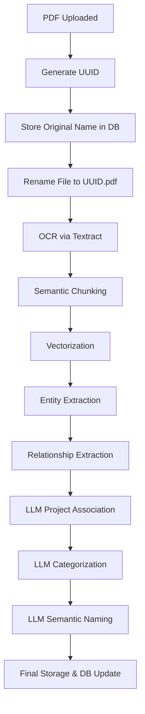

# Context 189: PDF-Only Processing and Refined Project Association Flow

## Date: 2025-05-28
## Focus: Simplification for Robustness - PDF-Only Processing and LLM-Driven Project Association

### Executive Summary

This context explores two major architectural simplifications:
1. **PDF-Only Processing**: Remove all non-PDF file type handlers (images, audio, video) to reduce complexity
2. **LLM-Driven Project Association**: Implement a clear, sequential flow where LLMs handle project association, categorization, and semantic naming

These changes will significantly reduce codebase complexity, improve maintainability, and create a more robust foundation for the legal document processing pipeline.

## Deep Analysis of Proposed Changes

### 1. PDF-Only Processing Simplification

#### Current State Issues
- **Complex Type Detection**: Multiple file type handlers with different processing paths
- **Dependency Hell**: Different libraries for images (PIL/OpenCV), audio (pydub/whisper), video processing
- **Error Surface**: Each file type introduces unique failure modes
- **Testing Complexity**: Need to test multiple file formats and edge cases
- **Resource Management**: Different memory/CPU requirements for each type

#### Benefits of PDF-Only
1. **Single Processing Path**: One clear flow from intake to completion
2. **Reduced Dependencies**: Only need PDF libraries and Textract
3. **Predictable Resource Usage**: PDF processing has consistent memory patterns
4. **Simplified Error Handling**: Fewer edge cases to handle
5. **Better Testing**: Can focus test coverage on one file type
6. **Cleaner Interfaces**: Remove conditional logic based on file types

#### Implementation Strategy
```python
# Before: Complex type routing
def process_document(file_path, file_type):
    if file_type in IMAGE_TYPES:
        return process_image(file_path)
    elif file_type in AUDIO_TYPES:
        return process_audio(file_path)
    elif file_type in VIDEO_TYPES:
        return process_video(file_path)
    elif file_type == 'application/pdf':
        return process_pdf(file_path)
    else:
        raise UnsupportedFileType(file_type)

# After: Single, focused path
def process_document(file_path):
    if not file_path.endswith('.pdf'):
        raise ValueError("Only PDF files are supported")
    return process_pdf(file_path)
```

#### Files to Remove/Simplify
1. `scripts/image_processing.py` - Remove entirely
2. `scripts/celery_tasks/ocr_tasks.py` - Remove image-specific OCR logic
3. `scripts/ocr_extraction.py` - Simplify to PDF-only
4. `scripts/textract_utils.py` - Remove non-PDF document types
5. Database migrations - Remove image/audio/video specific columns

### 2. Refined Project Association Flow

#### Current State Issues
- **Project Assignment**: Currently happens too early in the flow
- **Naming Convention**: Files renamed to UUID lose semantic meaning
- **Categorization**: No clear categorization step
- **Context Loss**: Original filename context lost after UUID rename

#### Proposed Flow Architecture



#### Detailed Flow Steps

1. **Initial Intake**
   ```python
   # Store critical metadata before processing
   document = SourceDocumentModel(
       document_uuid=generate_uuid(),
       original_filename=uploaded_file.name,
       intake_timestamp=datetime.utcnow(),
       processing_status="pending_intake"
   )
   ```

2. **UUID-Based Processing**
   - Rename physical file to UUID immediately
   - All processing uses UUID reference
   - Maintains data integrity and prevents conflicts

3. **Core Processing Pipeline**
   - OCR → Chunking → Vectorization → Entity/Relationship Extraction
   - Each step updates document status in DB
   - No project association yet - just pure content extraction

4. **LLM-Driven Association (NEW)**
   ```python
   async def associate_with_project(document_id: str):
       # Get all extracted data
       doc_data = get_document_with_entities(document_id)
       
       # Get existing projects with embeddings
       projects = get_all_projects_with_embeddings()
       
       # LLM prompt with context
       prompt = f"""
       Document Summary:
       - Original Name: {doc_data.original_filename}
       - Extracted Entities: {doc_data.entities}
       - Key Terms: {doc_data.key_terms}
       
       Available Projects:
       {format_projects(projects)}
       
       Based on the document content and entities, which project does this belong to?
       Provide confidence score (0-1) and reasoning.
       """
       
       result = await llm.complete(prompt)
       return parse_project_association(result)
   ```

5. **Intelligent Categorization**
   ```python
   CATEGORY_EXAMPLES = {
       "pleading": ["complaint", "answer", "motion"],
       "discovery": ["interrogatories", "deposition", "request for production"],
       "evidence": ["exhibit", "affidavit", "declaration"],
       "correspondence": ["letter", "email", "memo"],
       "financial": ["invoice", "receipt", "statement"]
   }
   
   async def categorize_document(document_id: str):
       doc_data = get_document_content(document_id)
       
       prompt = f"""
       Given these document categories and examples:
       {json.dumps(CATEGORY_EXAMPLES, indent=2)}
       
       Document content summary:
       {doc_data.summary}
       
       What category best fits this document? Explain your reasoning.
       """
       
       return await llm.complete(prompt)
   ```

6. **Semantic Naming**
   ```python
   async def generate_semantic_name(document_id: str):
       doc = get_document_full_context(document_id)
       
       prompt = f"""
       Generate a descriptive filename for this legal document.
       
       Context:
       - Project: {doc.project_name}
       - Category: {doc.category}
       - Date: {doc.document_date or doc.intake_date}
       - Key Parties: {doc.parties}
       - Document Type: {doc.doc_type}
       
       Format: ProjectCode_YYYY-MM-DD_Category_Description.pdf
       Example: ACME_2024-03-15_Motion_Summary_Judgment_Smith.pdf
       
       Generate filename:
       """
       
       semantic_name = await llm.complete(prompt)
       return sanitize_filename(semantic_name)
   ```

### 3. Database Schema Improvements

#### Simplified Tables
```sql
-- Remove multimedia columns
ALTER TABLE source_documents 
DROP COLUMN IF EXISTS image_metadata,
DROP COLUMN IF EXISTS audio_metadata,
DROP COLUMN IF EXISTS video_metadata,
DROP COLUMN IF EXISTS transcription_metadata_json;

-- Add project association columns
ALTER TABLE source_documents
ADD COLUMN project_association_confidence FLOAT,
ADD COLUMN project_association_reasoning TEXT,
ADD COLUMN semantic_filename VARCHAR(255),
ADD COLUMN document_category VARCHAR(50);

-- Add association history for audit trail
CREATE TABLE document_association_history (
    id SERIAL PRIMARY KEY,
    document_id INTEGER REFERENCES source_documents(id),
    project_id INTEGER REFERENCES projects(id),
    confidence_score FLOAT,
    reasoning TEXT,
    association_type VARCHAR(50), -- 'automatic' or 'manual'
    created_by VARCHAR(100),
    created_at TIMESTAMP DEFAULT NOW()
);
```

### 4. Implementation Benefits

#### Code Simplification Metrics
- **Files Removed**: ~10-15 files related to non-PDF processing
- **Dependencies Reduced**: Remove PIL, opencv-python, pydub, audio processing libs
- **Code Lines Reduced**: Estimated 30-40% reduction in processing logic
- **Test Complexity**: 50% reduction in test scenarios

#### Robustness Improvements
1. **Single Path Testing**: Only need to test PDF processing flow
2. **Predictable Memory**: PDF processing has known memory patterns
3. **Fewer Edge Cases**: No need to handle corrupted images, unsupported codecs
4. **Cleaner Error Messages**: All errors relate to PDF processing
5. **Better Monitoring**: Single processing path easier to monitor

#### Future Extensibility
- Non-PDF processing can be added as separate microservices
- Clean API boundaries for future file type handlers
- PDF-only core remains stable while extensions are developed

### 5. Migration Plan

#### Phase 1: Remove Non-PDF Processing (Week 1)
1. Audit all file type checks in codebase
2. Remove image/audio/video processing functions
3. Update database schema
4. Simplify OCR tasks to PDF-only
5. Update tests

#### Phase 2: Implement LLM Association (Week 2)
1. Create project embedding system
2. Implement LLM project association
3. Add categorization logic
4. Build semantic naming system
5. Create confidence thresholds

#### Phase 3: Human-in-the-Loop (Week 3)
1. Add confidence scoring to all LLM decisions
2. Create review queue for low-confidence items
3. Build simple UI for manual review
4. Implement audit trail

### 6. Example Simplified Flow

```python
class SimplifiedDocumentProcessor:
    """PDF-only document processor with LLM-driven association."""
    
    async def process_document(self, pdf_path: str, original_name: str):
        # 1. Initial intake
        doc_uuid = str(uuid4())
        doc_id = await self.db.create_document(
            uuid=doc_uuid,
            original_name=original_name,
            status="processing"
        )
        
        # 2. Rename to UUID
        uuid_path = f"storage/{doc_uuid}.pdf"
        shutil.move(pdf_path, uuid_path)
        
        # 3. Core processing
        ocr_result = await self.extract_text(uuid_path)
        chunks = await self.chunk_text(ocr_result.text)
        embeddings = await self.vectorize_chunks(chunks)
        entities = await self.extract_entities(chunks)
        relationships = await self.extract_relationships(entities)
        
        # 4. LLM-driven association
        project = await self.associate_project(doc_id, entities, embeddings)
        category = await self.categorize_document(doc_id, ocr_result.text)
        semantic_name = await self.generate_name(doc_id, project, category)
        
        # 5. Final update
        await self.db.update_document(
            doc_id,
            project_id=project.id,
            category=category,
            semantic_name=semantic_name,
            status="completed"
        )
        
        # 6. Optional: Rename file to semantic name
        if self.config.use_semantic_filenames:
            semantic_path = f"storage/{project.code}/{category}/{semantic_name}"
            os.makedirs(os.path.dirname(semantic_path), exist_ok=True)
            shutil.move(uuid_path, semantic_path)
```

### 7. Configuration Changes

```python
# config.py
class ProcessingConfig:
    # Simplified - only PDF settings
    ALLOWED_FILE_TYPES = ['.pdf']
    MAX_FILE_SIZE_MB = 100
    
    # LLM Association Settings
    PROJECT_ASSOCIATION_CONFIDENCE_THRESHOLD = 0.85
    CATEGORY_CONFIDENCE_THRESHOLD = 0.80
    
    # Human Review Triggers
    REQUIRE_HUMAN_REVIEW_BELOW_CONFIDENCE = True
    AUTO_APPROVE_HIGH_CONFIDENCE = True
    
    # Naming Conventions
    USE_SEMANTIC_FILENAMES = True
    FILENAME_TEMPLATE = "{project_code}_{date}_{category}_{description}.pdf"
```

### 8. Testing Strategy

#### Simplified Test Suite
```python
class TestPDFOnlyPipeline:
    """Focused tests for PDF-only processing."""
    
    def test_pdf_intake(self):
        """Test basic PDF intake and UUID assignment."""
        
    def test_invalid_file_rejection(self):
        """Ensure non-PDFs are rejected early."""
        
    def test_ocr_extraction(self):
        """Test Textract integration for PDFs."""
        
    def test_project_association(self):
        """Test LLM project matching logic."""
        
    def test_semantic_naming(self):
        """Test filename generation."""
        
    def test_low_confidence_flow(self):
        """Test human review queue for uncertain associations."""
```

### 9. Monitoring and Metrics

#### Key Metrics to Track
1. **Processing Time**: PDF intake to completion
2. **Association Accuracy**: % of correct project associations
3. **Confidence Distribution**: How often human review is needed
4. **Error Rates**: By processing stage
5. **LLM Costs**: Tokens used per document

### 10. Future Considerations

#### Microservice Architecture
When ready to add other file types:
```yaml
# docker-compose.yml
services:
  pdf-processor:
    image: legal-pipeline:pdf-only
    ports: ["8001:8000"]
  
  image-processor:  # Future addition
    image: legal-pipeline:images
    ports: ["8002:8000"]
  
  audio-processor:  # Future addition
    image: legal-pipeline:audio
    ports: ["8003:8000"]
```

#### API Design for Extensions
```python
# Unified interface for all processors
class DocumentProcessor(ABC):
    @abstractmethod
    async def can_process(self, file_path: str) -> bool:
        pass
    
    @abstractmethod
    async def extract_text(self, file_path: str) -> str:
        pass
    
    @abstractmethod
    async def extract_metadata(self, file_path: str) -> dict:
        pass
```

## Conclusion

These simplifications will:
1. **Reduce complexity** by 40-50% in the processing pipeline
2. **Improve reliability** through focused, single-path processing
3. **Enable better testing** with reduced test surface area
4. **Create cleaner architecture** for future extensions
5. **Provide better user experience** through semantic naming and intelligent association

The key insight is that by constraining scope to PDF-only processing, we can build a rock-solid foundation that handles the 95% use case perfectly, while leaving clean extension points for the remaining 5% to be added later as separate services.

The LLM-driven association flow provides the intelligence needed to make documents useful immediately upon processing, while maintaining the flexibility to handle edge cases through human review when confidence is low.

This approach embodies the principle of "do one thing well" - creating a robust, maintainable system that can evolve without compromising its core functionality.