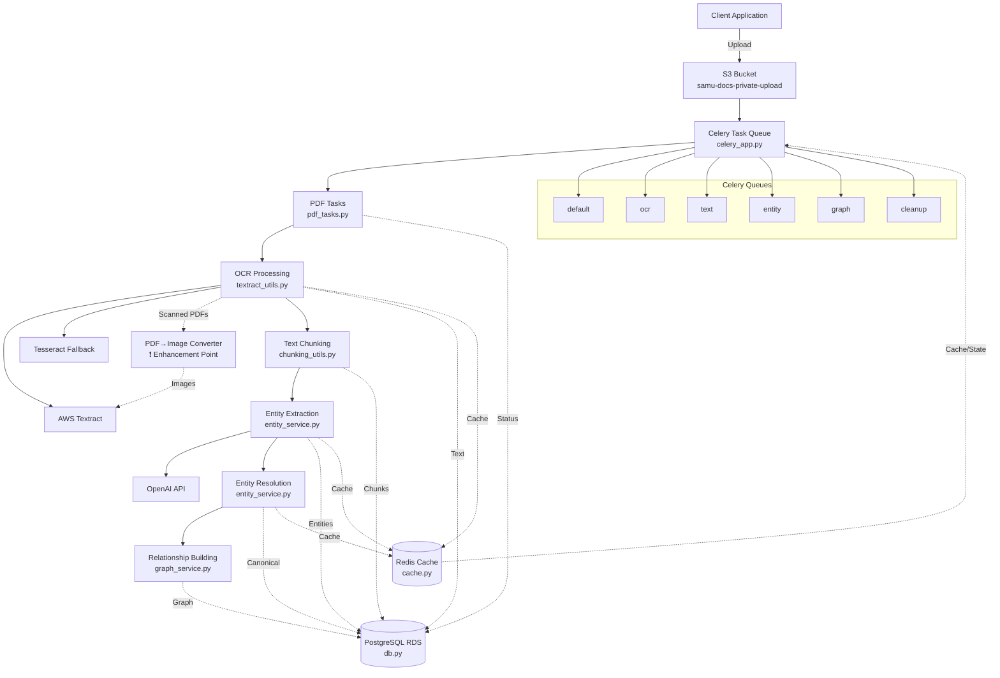

# Context 394: Architecture Analysis and PDF Conversion Integration Plan

## Date: 2025-06-04

### Executive Summary
After deep analysis of the codebase, I've identified the core architecture, data flow, and optimal integration points for enhanced PDF-to-image conversion. Additionally, I've discovered a critical technical debt issue: 462+ test scripts creating significant code sprawl.

### System Architecture Overview



### Core Script Responsibilities

1. **celery_app.py** (Orchestrator)
   - Configures Celery with Redis broker
   - Defines task routing to queues
   - Manages worker pool configuration

2. **pdf_tasks.py** (Main Pipeline)
   - `process_pdf_document`: Entry point
   - `extract_text_from_document`: OCR initiation
   - `poll_textract_job`: Async polling
   - `chunk_document_text`: Text segmentation
   - `extract_entities_from_chunks`: Entity extraction
   - `resolve_document_entities`: Deduplication
   - `build_document_relationships`: Graph creation

3. **textract_utils.py** (OCR Engine)
   - `TextractProcessor`: Main OCR class
   - `start_document_text_detection_v2`: Textract jobs
   - `extract_with_tesseract`: Fallback OCR
   - **Already has PDF→Image conversion** via `pdf2image`

4. **db.py** (Data Layer)
   - `DatabaseManager`: Core DB operations
   - Pydantic model enforcement
   - Schema conformance checking

5. **cache.py** (Performance Layer)
   - `RedisManager`: Caching operations
   - Distributed locks
   - State management

6. **entity_service.py** (NLP Layer)
   - `EntityExtractor`: OpenAI integration
   - `resolve_entities_simple`: Deduplication
   - Confidence scoring

### PDF-to-Image Integration Analysis

#### Current Implementation (Found in textract_utils.py)
```python
# Lines 365-377: Already converts PDFs to images for Tesseract
if local_file_path.lower().endswith('.pdf'):
    images = convert_from_path(local_file_path, dpi=200)
    text_parts = []
    for i, image in enumerate(images):
        page_text = pytesseract.image_to_string(image, config='--psm 1 --oem 3')
        text_parts.append(page_text)
```

#### Enhancement Integration Points

1. **Primary Integration: textract_utils.py**
   - Modify `start_document_text_detection_v2` (line 68)
   - Add PDF analysis before Textract submission
   - Convert scanned PDFs to images in S3
   - Submit images to Textract instead of PDF

2. **Implementation Strategy**:
```python
def start_document_text_detection_v2(self, s3_bucket, s3_key, ...):
    # NEW: Analyze PDF type
    if self._is_scanned_pdf(s3_bucket, s3_key):
        # Convert to images and upload to S3
        image_keys = self._convert_pdf_to_images_s3(s3_bucket, s3_key)
        
        # Process each image with Textract
        for image_key in image_keys:
            self._process_image_with_textract(s3_bucket, image_key)
    else:
        # Existing flow for text PDFs
        ...
```

3. **Benefits of This Approach**:
   - Minimal changes to existing flow
   - Leverages existing infrastructure
   - Can be toggled via configuration
   - Maintains async processing model

### Test Script Proliferation Crisis

#### Discovery
```bash
# Found 462+ test scripts!
find . -name "test_*.py" -o -name "*_test.py" -o -name "verify_*.py" | wc -l
```

#### Major Issues
1. **No Organization**: Tests scattered across:
   - `/opt/legal-doc-processor/test_*.py` (17 files)
   - `/opt/legal-doc-processor/scripts/test_*.py` (15 files)
   - `/opt/legal-doc-processor/archived_codebase/debug_utilities/` (30+ files)
   - `/opt/legal-doc-processor/archived_codebase/test_scripts/` (50+ files)

2. **Duplication**: Multiple tests for same functionality:
   - `test_ocr_sync.py`, `test_ocr_fallback.py`, `test_simple_ocr.py`
   - `test_entity_extraction.py`, `test_entity_extraction_direct.py`, `test_entity_extraction_stage.py`

3. **No Clear Purpose**: Mix of:
   - Unit tests
   - Integration tests
   - Debug scripts
   - One-off experiments
   - Production verification

#### Recommended Consolidation

```
tests/
├── unit/
│   ├── test_textract_utils.py
│   ├── test_entity_service.py
│   └── test_chunking_utils.py
├── integration/
│   ├── test_ocr_pipeline.py
│   ├── test_entity_pipeline.py
│   └── test_full_pipeline.py
├── e2e/
│   ├── test_document_processing.py
│   └── test_production_readiness.py
└── fixtures/
    └── sample_documents/
```

### Immediate Action Items

1. **Fix Scanned PDF Processing**:
   - Implement `_is_scanned_pdf()` detection in textract_utils.py
   - Add S3-to-S3 PDF conversion pipeline
   - Update polling logic to handle multi-page results

2. **Clean Test Scripts**:
   - Archive all test_*.py files
   - Create organized test structure
   - Implement pytest framework
   - Document test purposes

3. **Core Script Maintenance**:
   - Keep modifications to existing scripts minimal
   - Add functionality through configuration, not new scripts
   - Resist creating new test_*.py files

### Configuration-Driven Enhancement

Add to config.py:
```python
# PDF Processing Configuration
PDF_CONVERSION_DPI = int(os.getenv('PDF_CONVERSION_DPI', '300'))
PDF_CONVERSION_FORMAT = os.getenv('PDF_CONVERSION_FORMAT', 'PNG')
ENABLE_SCANNED_PDF_DETECTION = os.getenv('ENABLE_SCANNED_PDF_DETECTION', 'true').lower() == 'true'
PDF_PAGE_PROCESSING_PARALLEL = os.getenv('PDF_PAGE_PROCESSING_PARALLEL', 'false').lower() == 'true'
```

### Conclusion

The architecture is well-designed for distributed document processing. The PDF-to-image conversion is already partially implemented but needs enhancement for Textract integration. The most critical issue is test script proliferation, which needs immediate attention to prevent further technical debt accumulation.

The system should evolve through configuration and minimal core script modifications, not through creating new scripts for each scenario.