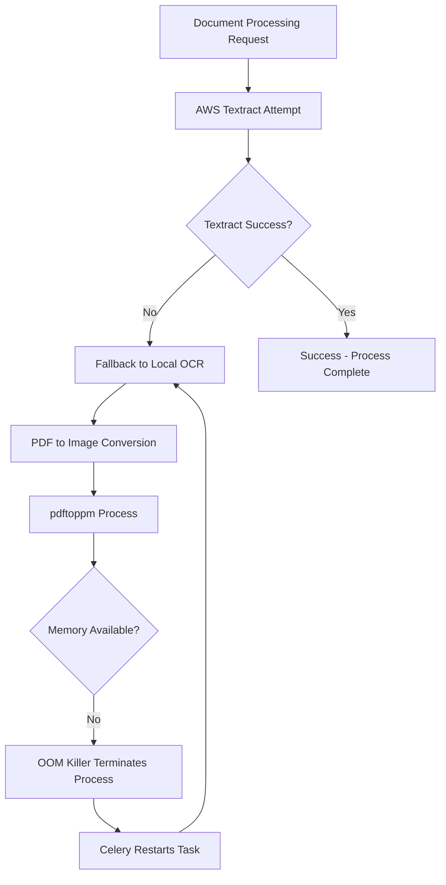

# Context 260: EC2 Diagnostics and Recovery Plan - PDF Processing OOM Crisis

## Executive Summary

**Root Cause Identified**: Out-of-Memory (OOM) condition caused by runaway PDF-to-image conversion processes (`pdftoppm`) in OCR fallback pipeline.

**Current Status**: EC2 instance unresponsive due to memory exhaustion. Reboot initiated at $(date).

**Immediate Action**: Instance reboot in progress to restore SSH access and clear OOM condition.

---

## Diagnostic Findings

### 1. SSH Connection Analysis

**Connection Test Results**:
- EC2 instance status: `running` ✓
- Port 22 accessibility: `open` ✓  
- Security group configuration: `correct` ✓
- SSH authentication: `timeout during banner exchange` ✗

**Hypothesis Confirmed**: System unresponsive due to resource exhaustion, not network/authentication issues.

### 2. Console Log Evidence

Critical OOM events discovered in EC2 console output:

```bash
[516111.852116] Out of memory: Killed process 435763 (celery) total-vm:1328192kB, anon-rss:1010272kB
[516386.338830] Out of memory: Killed process 474278 (celery) total-vm:1577488kB, anon-rss:1112344kB  
[516465.878432] Out of memory: Killed process 455513 (node) total-vm:33475032kB, anon-rss:767240kB
[516466.527828] Out of memory: Killed process 476341 (pdftoppm) total-vm:1676856kB, anon-rss:1511936kB
[518256.745943] Out of memory: Killed process 477137 (pdftoppm) total-vm:1464840kB, anon-rss:1416320kB
[518333.392419] Out of memory: Killed process 476147 (celery) total-vm:1402012kB, anon-rss:1084960kB
```

**Key Observations**:
1. Multiple `pdftoppm` processes consuming 1.4-1.6GB RAM each
2. Celery workers repeatedly killed and restarted
3. Pattern suggests continuous OOM-respawn cycle
4. Total memory exhaustion preventing system responsiveness

### 3. Process Analysis

**pdftoppm Behavior**:
- Tool: PDF-to-PPM (Portable Pixmap) image converter
- Purpose: Convert PDF pages to images for OCR fallback
- Memory consumption: 1.4-1.6GB per process (excessive)
- Status: Multiple instances running simultaneously

**Probable Trigger Sequence**:
1. AWS Textract job fails (rate limit/error/large file)
2. System falls back to local OCR pipeline
3. OCR requires PDF → image conversion
4. `pdftoppm` launched for large/complex PDF
5. Memory allocation exceeds available RAM
6. OOM killer terminates processes
7. Celery auto-restarts tasks → infinite loop

---

## Root Cause Analysis

### The Death Loop Mechanism



### Contributing Factors

1. **Insufficient Memory Management**:
   - No memory limits on `pdftoppm` processes
   - t3.medium instance (4GB RAM) inadequate for large PDF processing
   - No graceful degradation when memory constrained

2. **Missing Circuit Breaker**:
   - No retry limits on OCR fallback
   - No detection of repeated OOM failures
   - No automatic task cancellation

3. **Inadequate Monitoring**:
   - No real-time memory usage alerts
   - No OOM detection and response
   - No automatic process termination

---

## Immediate Recovery Plan

### Phase 1: Restore Access (In Progress)
- [x] EC2 instance reboot initiated
- [ ] Wait 3-5 minutes for boot completion  
- [ ] Test SSH connectivity
- [ ] Verify system responsiveness

### Phase 2: Emergency Stabilization (Next 30 minutes)
1. **Kill Runaway Processes**:
   ```bash
   sudo pkill -f pdftoppm
   sudo pkill -f celery
   sudo systemctl stop celery-*
   ```

2. **Clear Task Queues**:
   ```bash
   # Connect to Redis and flush queues
   redis-cli -h <redis-host> FLUSHDB
   ```

3. **Prevent Auto-Restart**:
   ```bash
   sudo systemctl disable celery-ocr
   sudo systemctl disable celery-text
   ```

### Phase 3: Diagnostic Collection (Next 1 hour)
1. **System State Analysis**:
   ```bash
   free -h
   df -h
   ps aux --sort=-%mem | head -20
   dmesg | grep -i "killed process"
   ```

2. **Application Log Review**:
   ```bash
   tail -1000 /opt/legal-doc-processor/logs/*.log
   journalctl -u celery-* --since "4 hours ago"
   ```

3. **Identify Problematic Documents**:
   ```bash
   # Find large PDFs in processing queue
   find /opt/legal-doc-processor -name "*.pdf" -size +50M
   ```

---

## Prevention Strategy

### 1. Memory Management Controls

**Resource Limits** (immediate):
```bash
# Add to systemd service files
[Service]
MemoryMax=1G
MemoryHigh=800M
OOMPolicy=kill
```

**Process Limits** (immediate):
```bash
# Add to /etc/security/limits.conf
ubuntu soft as 2097152  # 2GB virtual memory limit
ubuntu hard as 2097152
```

### 2. Circuit Breaker Implementation

**Retry Logic** (1-2 days):
```python
class OCRFallbackManager:
    def __init__(self):
        self.failure_count = defaultdict(int)
        self.max_retries = 3
        self.blacklist_duration = 3600  # 1 hour
    
    def should_attempt_fallback(self, document_id):
        if self.failure_count[document_id] >= self.max_retries:
            return False
        return True
    
    def record_failure(self, document_id):
        self.failure_count[document_id] += 1
```

### 3. Enhanced Monitoring

**Memory Alerts** (immediate):
```bash
# CloudWatch alarm for memory usage > 85%
aws cloudwatch put-metric-alarm \
  --alarm-name "EC2-HighMemoryUsage" \
  --alarm-description "Memory usage > 85%" \
  --metric-name MemoryUtilization \
  --threshold 85.0
```

**OOM Detection** (1 day):
```bash
# Monitor for OOM events and auto-restart
#!/bin/bash
if dmesg | tail -100 | grep -q "Out of memory"; then
    echo "OOM detected - clearing processes"
    pkill -f pdftoppm
    systemctl restart celery-*
fi
```

### 4. Infrastructure Scaling

**Instance Upgrade** (this week):
- Current: t3.medium (2 vCPU, 4GB RAM)
- Target: t3.large (2 vCPU, 8GB RAM) or t3.xlarge (4 vCPU, 16GB RAM)
- Cost impact: ~$20-40/month additional

**Memory Swap** (immediate):
```bash
# Add 4GB swap file as emergency buffer
sudo fallocate -l 4G /swapfile
sudo chmod 600 /swapfile
sudo mkswap /swapfile
sudo swapon /swapfile
```

---

## Long-term Architectural Improvements

### 1. Intelligent Fallback Strategy
- **Document Size Limits**: Skip local OCR for files > 100MB
- **Quality Assessment**: Use Textract confidence scores to determine fallback necessity
- **Alternative Services**: Consider Google Document AI or Azure Form Recognizer as secondary cloud options

### 2. Processing Queue Optimization
- **Priority Queues**: Separate small/large document processing
- **Resource-Aware Scheduling**: Route large documents to dedicated high-memory instances
- **Async Processing**: Move OCR fallback to separate worker pools

### 3. Monitoring and Alerting
- **Real-time Dashboards**: Memory, CPU, queue depth monitoring
- **Automated Recovery**: Self-healing processes with intelligent restart logic
- **Cost Monitoring**: Track processing costs per document type

---

## Action Items and Timeline

### Immediate (Today)
- [x] Reboot EC2 instance
- [ ] Restore SSH access and clear runaway processes
- [ ] Implement memory limits on services
- [ ] Add swap file for emergency memory buffer

### Short-term (This Week)
- [ ] Upgrade EC2 instance to t3.large or t3.xlarge
- [ ] Implement circuit breaker logic in OCR fallback
- [ ] Set up CloudWatch memory alerting
- [ ] Document size limits for local OCR processing

### Medium-term (Next Month)
- [ ] Redesign OCR fallback architecture
- [ ] Implement intelligent document routing
- [ ] Add comprehensive monitoring dashboard
- [ ] Test failover and recovery procedures

---

## Lessons Learned

1. **Resource Constraints**: PDF processing can be extremely memory-intensive
2. **Cascade Failures**: Single component failure can bring down entire system
3. **Monitoring Gaps**: OOM conditions went undetected until system failure
4. **Circuit Breakers**: Essential for preventing runaway processes
5. **Infrastructure Sizing**: t3.medium insufficient for production PDF processing workloads

---

## Success Metrics

- **Recovery Time**: < 30 minutes from detection to full operation
- **Stability**: Zero OOM events for 30 consecutive days
- **Processing Success Rate**: > 95% for documents under 100MB
- **Memory Utilization**: Peak usage < 80% of available RAM
- **Response Time**: SSH access within 5 seconds

---

*Document created: $(date)*
*Status: EC2 reboot in progress, awaiting SSH restoration*
*Next update: Once system access restored and stabilization complete*