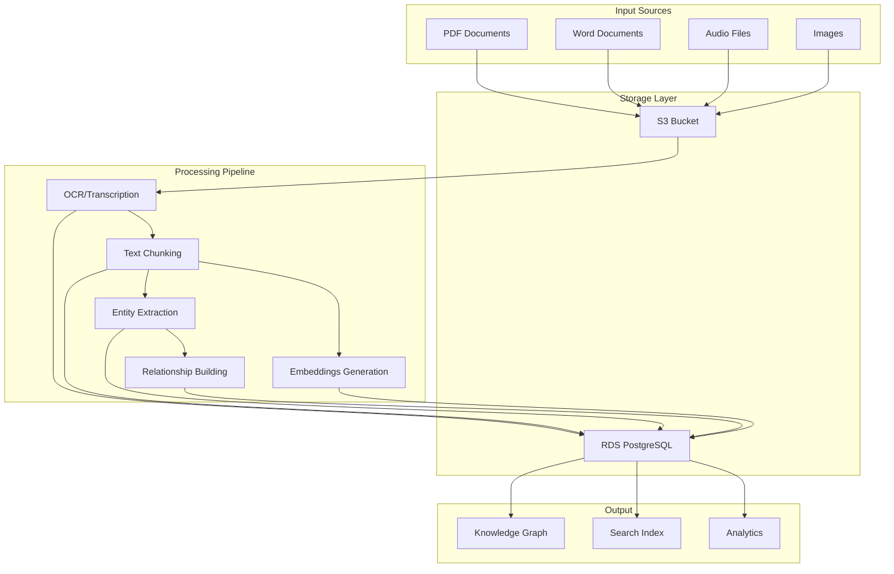
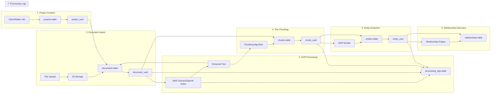
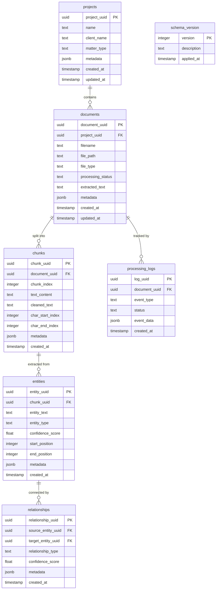
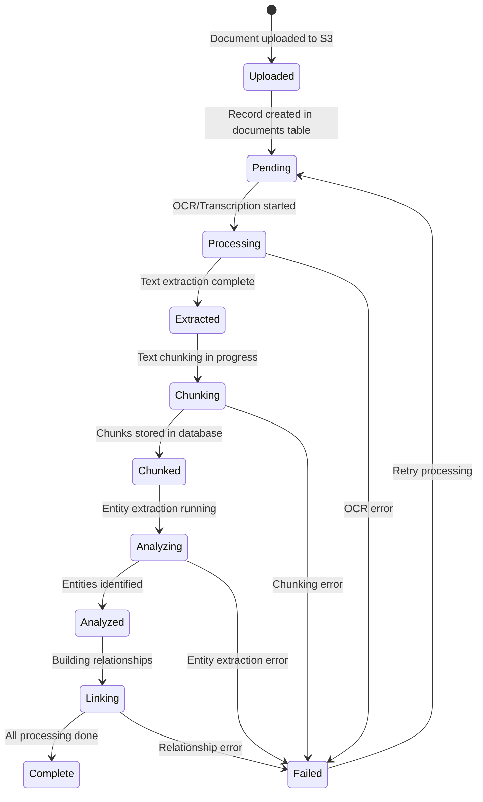
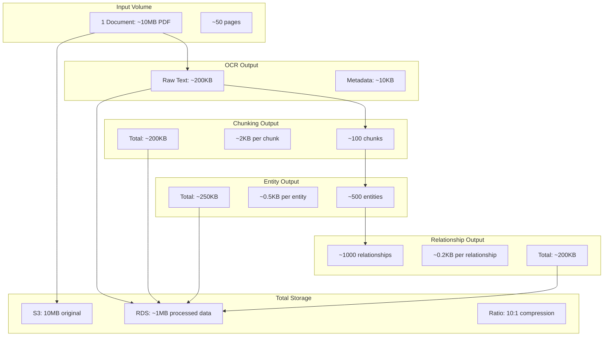
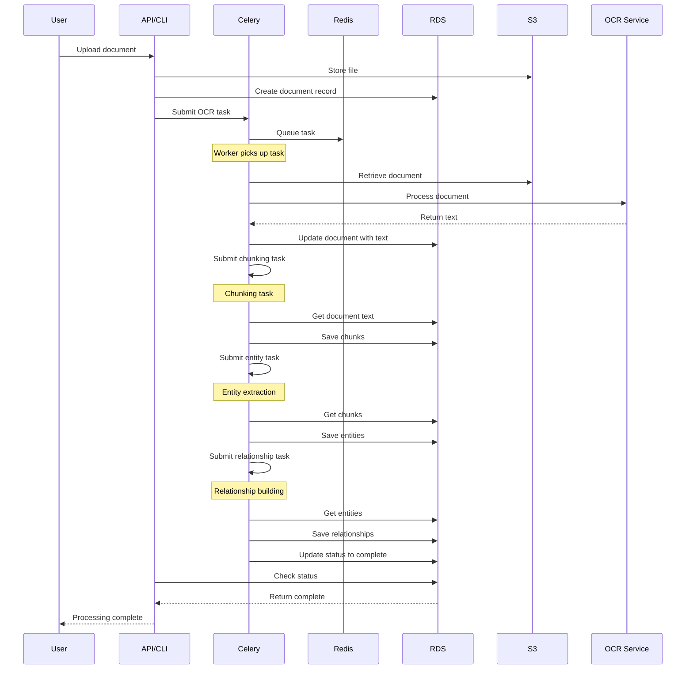
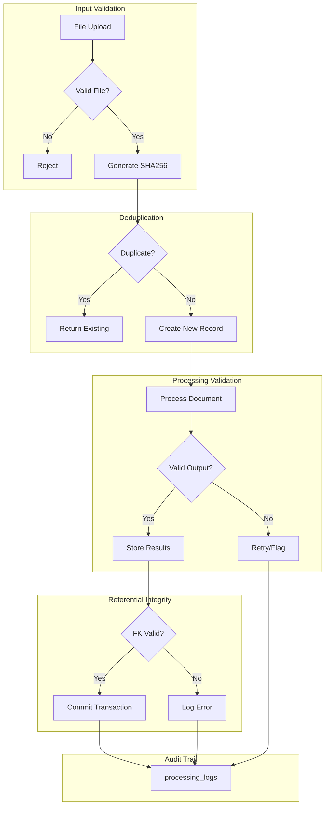
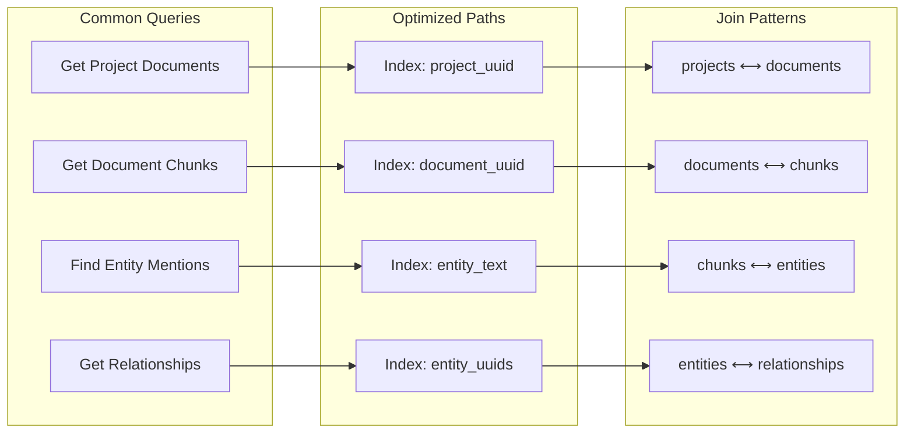
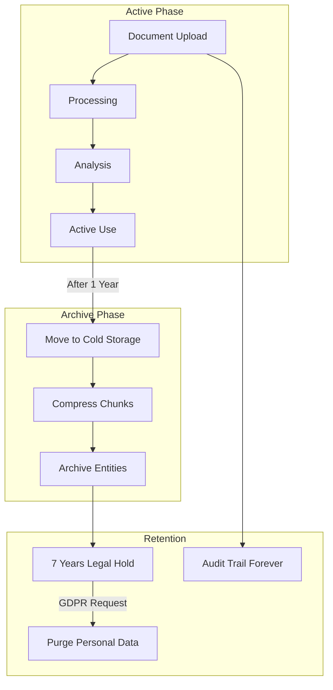
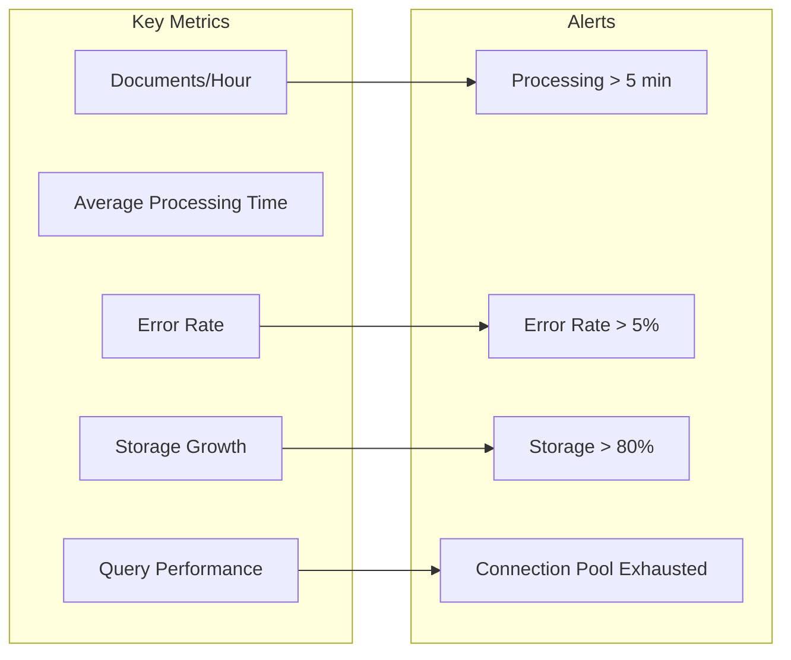

# Context 242: RDS Data Flow Analysis and Architecture

**Date**: 2025-05-30
**Type**: Data Flow Architecture
**Status**: ACTIVE
**Component**: RDS PostgreSQL Data Flow and Processing Pipeline

## Overview

This document visualizes the data flow through the RDS-based document processing pipeline, showing how documents move from intake through final knowledge graph creation.

## High-Level Data Flow



## Detailed RDS Table Data Flow



## RDS Schema Data Relationships



## Processing State Flow



## Data Volume Flow Analysis



## Celery Task Flow



## Data Integrity Flow



## Query Pattern Flow



## Performance Characteristics

### Write Performance
- **Document Creation**: ~10ms (single record)
- **Chunk Batch Insert**: ~100ms (100 chunks)
- **Entity Batch Insert**: ~200ms (500 entities)
- **Relationship Building**: ~500ms (1000 relationships)

### Read Performance
- **Document Retrieval**: ~5ms (with indexes)
- **Chunk Retrieval**: ~20ms (100 chunks)
- **Entity Search**: ~50ms (full-text search)
- **Graph Traversal**: ~100ms (2-hop relationships)

### Storage Efficiency
- **Original Document**: 10MB (S3)
- **Extracted Text**: 200KB (RDS)
- **Processing Metadata**: 50KB (RDS)
- **Total RDS Storage**: ~1MB per document
- **Compression Ratio**: 10:1

## Data Lifecycle



## Bottleneck Analysis

```mermaid
graph TB
    subgraph "Potential Bottlenecks"
        B1[OCR Processing: 5-30s per page]
        B2[Entity Extraction: 2s per chunk]
        B3[Relationship Building: O(n²) complexity]
        B4[Database Writes: Connection pool limits]
    end
    
    subgraph "Mitigation Strategies"
        M1[Parallel OCR with Textract]
        M2[Batch Entity Processing]
        M3[Graph Algorithm Optimization]
        M4[Connection Pool Tuning]
    end
    
    B1 --> M1
    B2 --> M2
    B3 --> M3
    B4 --> M4
```

## Monitoring Points



## Conclusion

The RDS implementation provides a straightforward, efficient data flow with clear progression from document upload through knowledge graph creation. The simplified 7-table schema reduces complexity while maintaining full tracking capabilities through the `processing_logs` table.

Key advantages of this flow:
1. **Linear progression** through well-defined states
2. **Strong referential integrity** with foreign keys
3. **Efficient storage** with 10:1 compression ratio
4. **Clear audit trail** for compliance
5. **Scalable architecture** with indexed access patterns

The main challenges are OCR processing time and relationship building complexity, both of which can be mitigated through parallel processing and algorithm optimization.