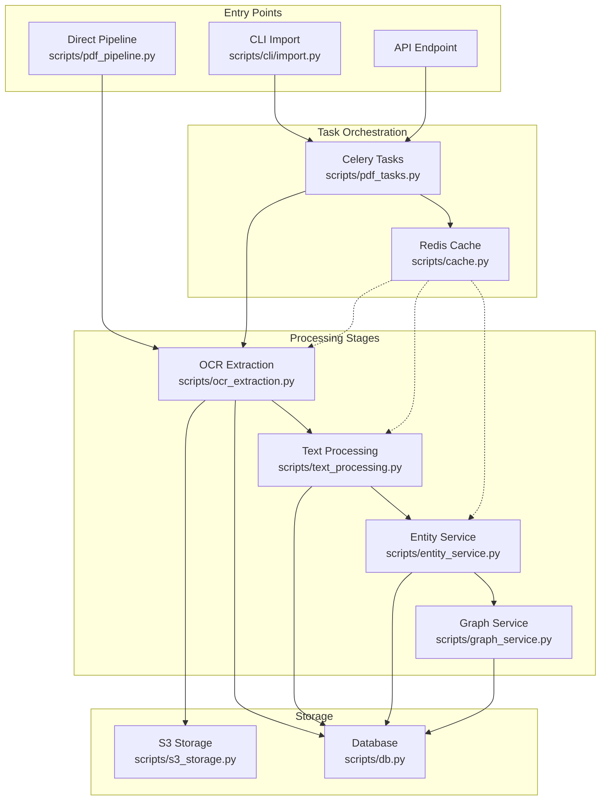
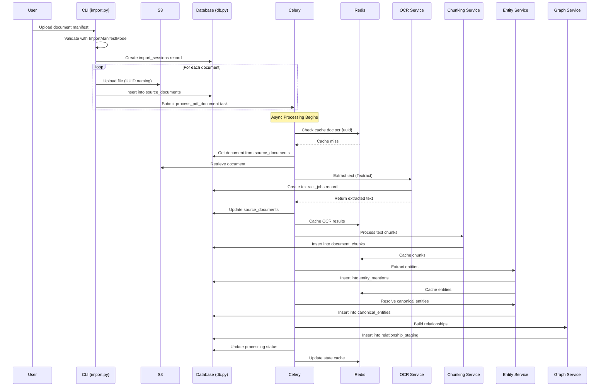
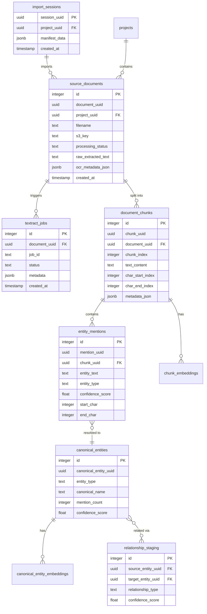
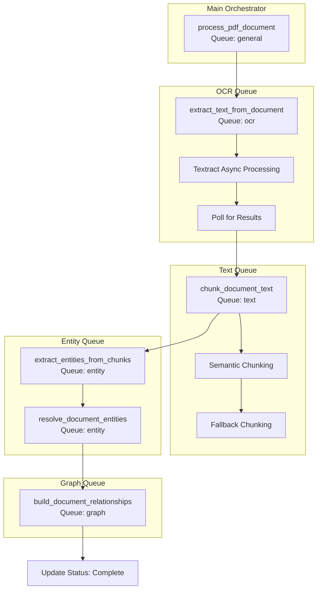
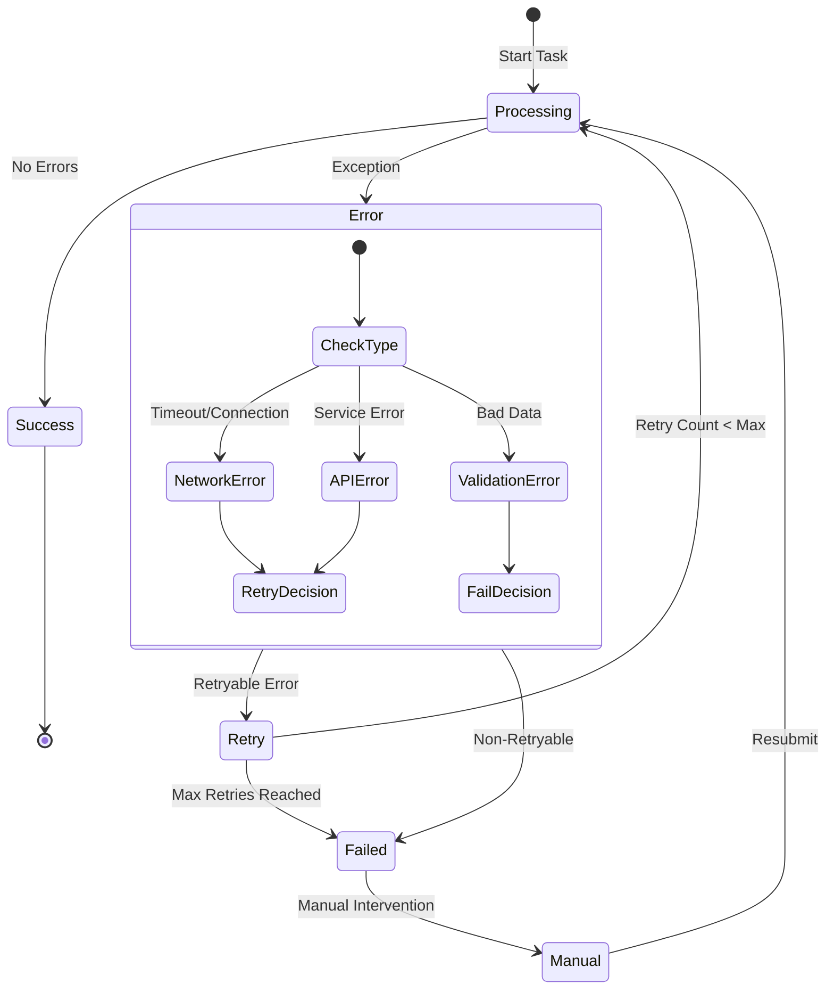
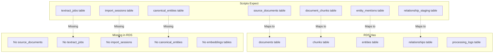

# Context 243: Scripts Implementation Flow Analysis

**Date**: 2025-05-30
**Type**: Implementation Architecture
**Status**: ACTIVE
**Component**: Actual Script Processing Flow and Dependencies

## Overview

This document analyzes the actual implementation flow in the `/scripts/` directory, revealing how the document processing pipeline is really structured versus the idealized RDS schema.

## High-Level Script Architecture



## Detailed Implementation Flow



## Actual Database Tables Used



## Celery Task Flow



## Redis Cache Architecture

```mermaid
graph LR
    subgraph "Cache Keys Structure"
        DOC[Document Level]
        CHUNK[Chunk Level]
        ENTITY[Entity Level]
        TASK[Task Level]
    end
    
    subgraph "Document Cache"
        DOC --> D1[doc:state:{uuid}]
        DOC --> D2[doc:ocr:{uuid}]
        DOC --> D3[doc:chunks:{uuid}]
        DOC --> D4[doc:canonical_entities:{uuid}]
    end
    
    subgraph "Chunk Cache"
        CHUNK --> C1[doc:chunk_text:{chunk_uuid}]
        CHUNK --> C2[doc:entities:{doc_uuid}:{chunk_id}]
    end
    
    subgraph "Processing Cache"
        TASK --> T1[task:status:{task_id}]
        TASK --> T2[textract:result:{uuid}]
    end
    
    subgraph "TTL Settings"
        TTL1[OCR: 7 days]
        TTL2[Chunks: 2 days]
        TTL3[Entities: 12 hours]
        TTL4[Task Status: 24 hours]
    end
    
    D2 --> TTL1
    D3 --> TTL2
    C2 --> TTL3
    T1 --> TTL4
```

## Error Handling and Recovery Flow



## Processing Time Analysis

```mermaid
gantt
    title Document Processing Timeline
    dateFormat X
    axisFormat %s
    
    section Import
    File Upload       :0, 2
    S3 Upload        :2, 3
    DB Record        :5, 1
    
    section OCR
    Textract Start   :6, 2
    Textract Process :8, 20
    Result Polling   :28, 5
    
    section Chunking
    Text Cleaning    :33, 2
    Chunk Creation   :35, 5
    DB Storage       :40, 2
    
    section Entities
    Entity Extract   :42, 10
    Entity Resolve   :52, 5
    
    section Graph
    Relationship Build :57, 8
    Graph Storage     :65, 2
    
    section Complete
    Status Update     :67, 1
```



## Implementation vs RDS Schema Discrepancies



## Key Implementation Patterns

### 1. **Conformance Validation**
```python
# Every database operation validates conformance
db_manager = DatabaseManager(validate_conformance=True)
```

### 2. **Idempotent Operations**
```python
# Tasks check for existing results before processing
existing = cache.get(f"doc:ocr:{document_uuid}")
if existing:
    return existing
```

### 3. **Rate Limiting**
```python
@rate_limit(calls=10, period=60)  # 10 calls per minute
def call_openai_api():
    pass
```

### 4. **Async Pattern**
```python
# Textract uses async API with polling
job_id = start_textract_job()
result = poll_for_completion(job_id)
```

## Performance Characteristics

### Processing Times (per document)
- **Import & Upload**: 2-5 seconds
- **OCR (Textract)**: 20-30 seconds
- **Text Chunking**: 5-10 seconds
- **Entity Extraction**: 10-15 seconds
- **Relationship Building**: 5-10 seconds
- **Total**: 45-70 seconds per document

### Bottlenecks
1. **OCR Processing**: Textract async API latency
2. **LLM Calls**: OpenAI API rate limits
3. **Database Writes**: Connection pool saturation
4. **Redis Operations**: Network latency

### Optimization Strategies
1. **Parallel OCR**: Process multiple pages concurrently
2. **Batch Operations**: Group database inserts
3. **Smart Caching**: Cache expensive operations
4. **Queue Prioritization**: Separate queues by operation type

## Conclusion

The actual implementation reveals a sophisticated but complex system that expects a different database schema than what RDS currently provides. The heavy use of caching, async processing, and Celery task orchestration enables scalable document processing, but the schema mismatch creates immediate operational challenges that must be resolved through mapping layers or schema alignment.